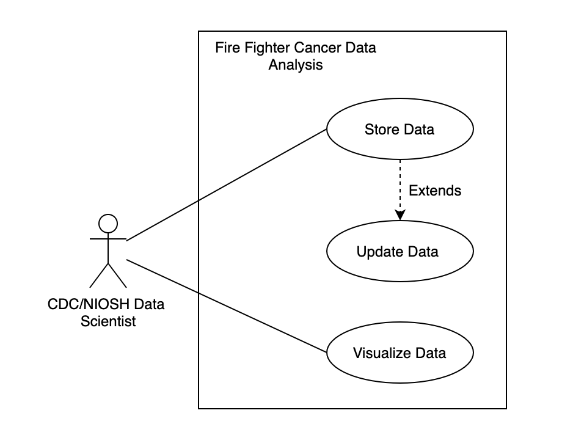

# Use Case Model

The above figure is our use case model diagram for our application.  In it, the actor (CDC data scientist) is able to either insert data into the database, or visualize the existing data using Tableau.
